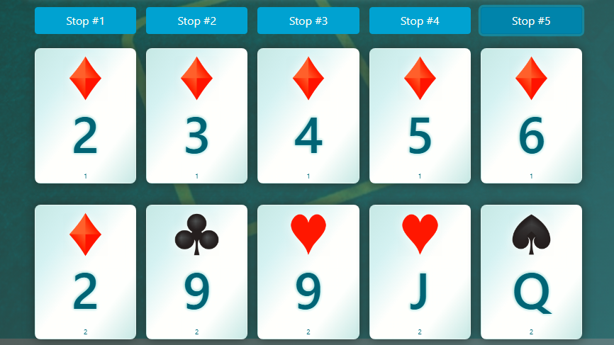
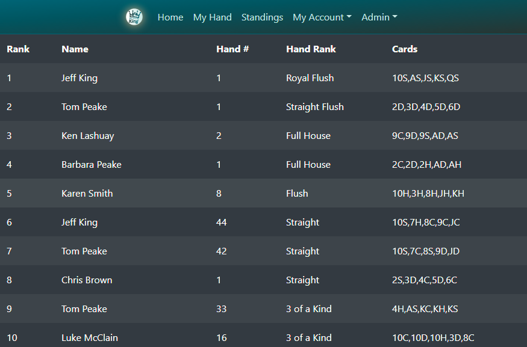

# Poker Run King
A React/PostgreSQL/Node/Express RESTful API, and event coordination application, designed around the popular Poker Run format.

This project was bootstrapped with [Create React App](https://github.com/facebook/create-react-app).

## Links
[View Application on Heroku](https://poker-run-king.herokuapp.com/)  
[View GitHub Repository](https://github.com/jazfunk/poker-run-app)


## Application Images

  


## Summary
A full-stack, RESTful API, built using Node.js, serving a React front-end, styled with Bootstrap 4.  Quite a challenging application to build, and it turned out to have more features than I initially intended.

By crafting robust, and secure endpoints, I've honed my Node.js skills, and solidifed my knowledge of the Web API paradigm.  

With the use of class-based stateful components, and reusable functional components, the code is clean, and easy to interpet.

## Prerequisites, Development Dependencies, & Installation
This project requires the following to be installed to run locally:
* [Node](https://nodejs.org/en/)
* [Npm](https://www.npmjs.com/)
* [Concurrently](https://www.npmjs.com/package/concurrently)
* [Dotenv](https://www.npmjs.com/package/dotenv)
* [Nodemon](https://www.npmjs.com/package/nodemon)

Installing Node will provide access to `npm`.

After all prerequisite installation is complete, navigate to the project directory, and run the development web server:
```
npm run dev
```

Run app in development mode:  Open [http://localhost:5000](http://localhost:5000) to view it in the browser.


## Built With
* [React](https://reactjs.org/docs/getting-started.html)
* [Node](https://nodejs.org/en/)
* [Boostrap v4](https://getbootstrap.com/docs/4.0/getting-started/download/)
* [CRA-Built-Watch](https://www.npmjs.com/package/cra-build-watch)
* [MDBReact](https://www.npmjs.com/package/mdbreact)
* [React-Window](https://www.npmjs.com/package/react-window)
* [PostgreSQL](https://www.postgresql.org/)
* [FluentNHibernate](https://www.nuget.org/packages/FluentNHibernate/)
* [Moment.js](https://momentjs.com/)
* [Axios](https://axios.com/)
* [Morgan](https://www.npmjs.com/package/morgan)
* [Express](https://expressjs.com/)
* [Bcrypt](https://www.npmjs.com/package/bcrypt)

## Deployment
* [Heroku](https://www.heroku.com)

## Author
* **Jeff King** - *Full Stack Software Developer* - [GitHub](https://github.com/jazfunk) | [LinkedIn](https://www.linkedin.com/in/jeffking222/) | [Website](https://jeff-king.net)
